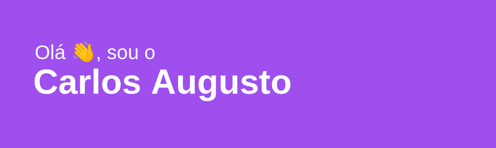

------------

------------

<h2>Sobre mim:</h2>

Sou um programador full stack junior com formação técnica pela <a href="https://www.betrybe.com/"  target="blank">Trybe</a>, com mais de 1.500 horas de aulas e mais de 30 projetos onde pude praticar meus conhecimentos adquiridos em diversas tecnologias como JavaScript, HTML, CSS, React, Node, Express.js, SQL, Git, Typescript, Python, MongoDB, Jest, React Testing Library, entre outras linguagens e frameworks.
Durante este curso também tive a oportunidade de ter experiências com projetos em grupo onde pude exercitar práticas de soft skills como liderança, comunicação, gestão de tempo, colaboração, pensamento crítico, metodologias ágeis (Scrum e Kanban), entre outras.

Sou apaixonado pelas possibilidades de criação e inovação que o estudo da programação fornece e procuro me aprofundar e aprender cada vez mais sobre esse mundo, porém a tecnologia não foi exatamente minha primeira área de estudos ou de atuação.

Tenho experiência com o setor financeiro, na empresa <a href="https://argo.com.vc/"  target="blank">Argo Construtora</a>, onde atuei como assistente, sendo responsável por lidar com o controle e cadastro de notas fiscais, manutenção de arquivos físicos e intermédio com setores financeiros de empresas fornecedoras e parceiras.

Tenho experiência com a área de design, atuando como modelador 3D em um projeto de realidade virtual realizado por uma parceria entre a <a href="https://uvv.br/"  target="blank">Universidade Vila Velha (UVV)</a> e a <a href="https://www.vale.com/pt/"  target="blank">Vale</a>. Fui responsável por fotografar objetos que foram recriados no projeto, por fazer a criação, otimização e texturização de peças 3D utilizando o software 3Ds Max e pela organização e separação, juntamente à equipe de designers, de tarefas e responsabilidades utilizando a metodologia ágil Kanban.

Atualmente busco oportunidades de desenvolver minha carreira de forma que possa estar sempre em contato com novos aprendizados e tendo a possibilidade de exercer minha criatividade.

------------

<h3 align="left">Contatos:</h3>

 

------------

<h3 align="left">Linguagens e ferramentas:</h3>

              

------------

&nbsp;&nbsp;

